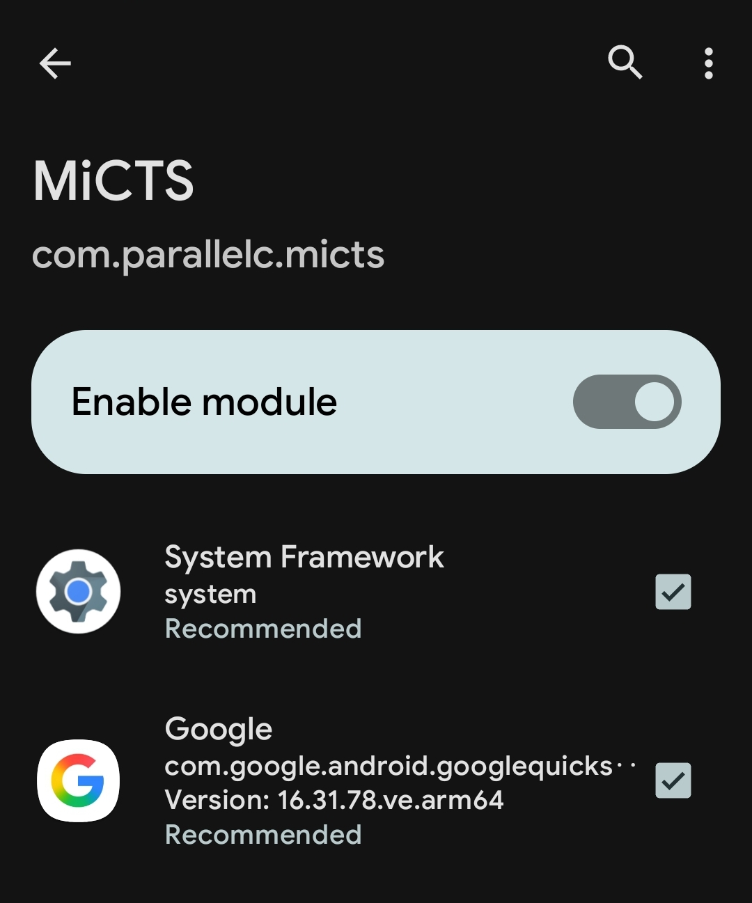
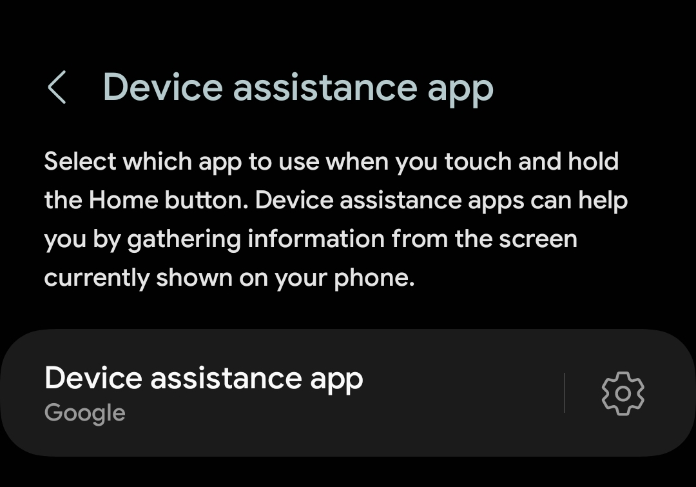
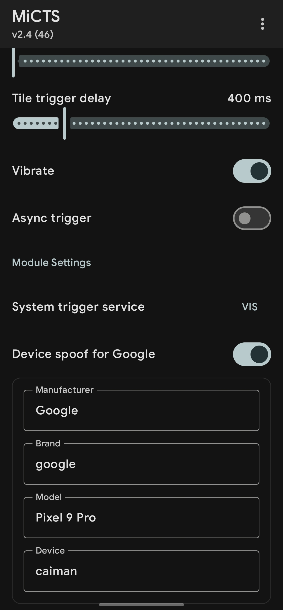
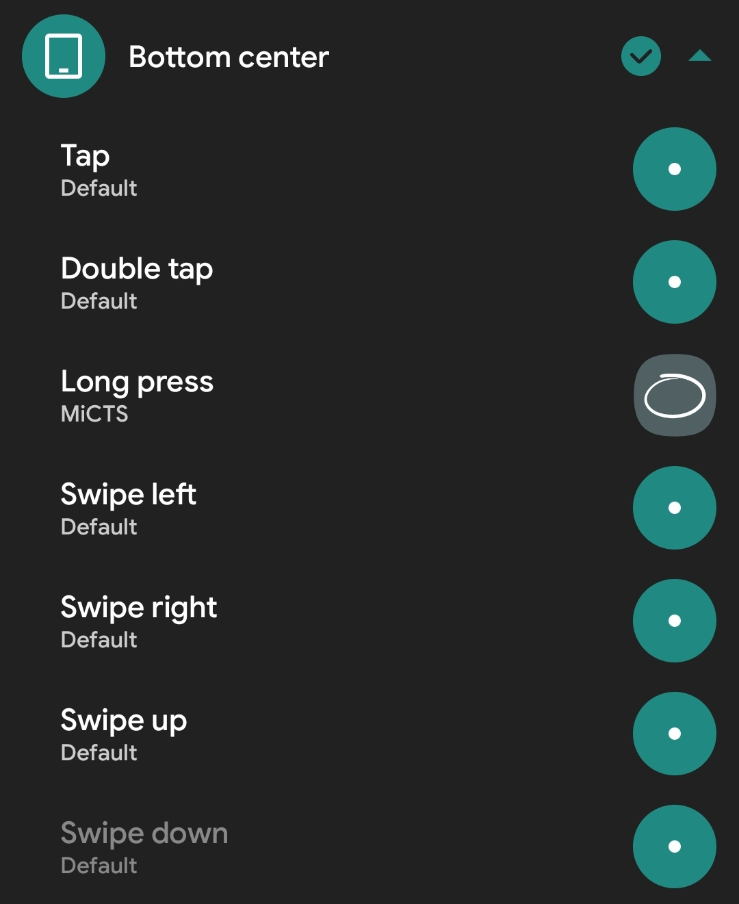

## INTRO
**Circle to Search** 是 Google 和 Samsung 联合推出的一项功能，让用户可以通过在屏幕上的任意位置进行圈选、高亮、涂鸦或点按，来快速搜索文字、图像或视频，而无需切换应用。 

关于圈定即搜 更深度的剖析可以去看看 [@NNNNNatsu](https://pwa.sspai.com/u/p2o51/overview) 大佬的文章：

[Circle to Search, XOXO：「圈定即搜」功能交互解析与入门指南](https://pwa.sspai.com/post/97858)

## MiCTS
正如 title，我们要在任意Android(≥9)设备上启用圈定即搜，需要借助一个LSPosed模块。

::github{repo="parallelcc/MiCTS"}

## PREPARATION
- 已获取root权限的设备，并安装了LSPosed。

## LET'S GO
0. 安装MiCTS模块。
1. 打开LSPosed Framework，通常情况下，您可以从通知栏的入口进入。
2. 打开模块选项，找到MiCTS，启用，勾选推荐的作用域。

3. 重启您的设备。
4. 将您的默认助理App更改为Google。一般情况下，您可以点击`设置`>`应用`>`默认应用程序`中找到其选项。

5. 您需要给Google应用取消后台限制，将电池优化更改为无限制，并允许自启动。

接下来您可以长按导航条，若`圈定即搜`正常触发，那么恭喜，您省去了一半的麻烦。

若未正常触发，那么我们需要额外的操作。

6. 打开 LSPosed 里的MiCTS页面，点击右下角的齿轮图标进入设置。
7. 可供参考的设置如下图，您可能需要授予其root权限。

接下来我们设置其触发方式（如果您无法正常长按导航栏触发）

8. 安装Xposed Edge(Pro) （您需要自行安装）
9. 在LSPosed Framework中启用 Xposed Edge，并重启其作用域。
10. 打开Xposed Edge，如下图设置。

接下来您可以再次尝试长按导航栏，他应该会像预期一样工作。

若您遇到了bug，可以向MiCTS项目提交issue。

这里是 Chongxi，期待与您的下一次见面。

_Thanks for watching._

--Chongxi 2025-08-25
