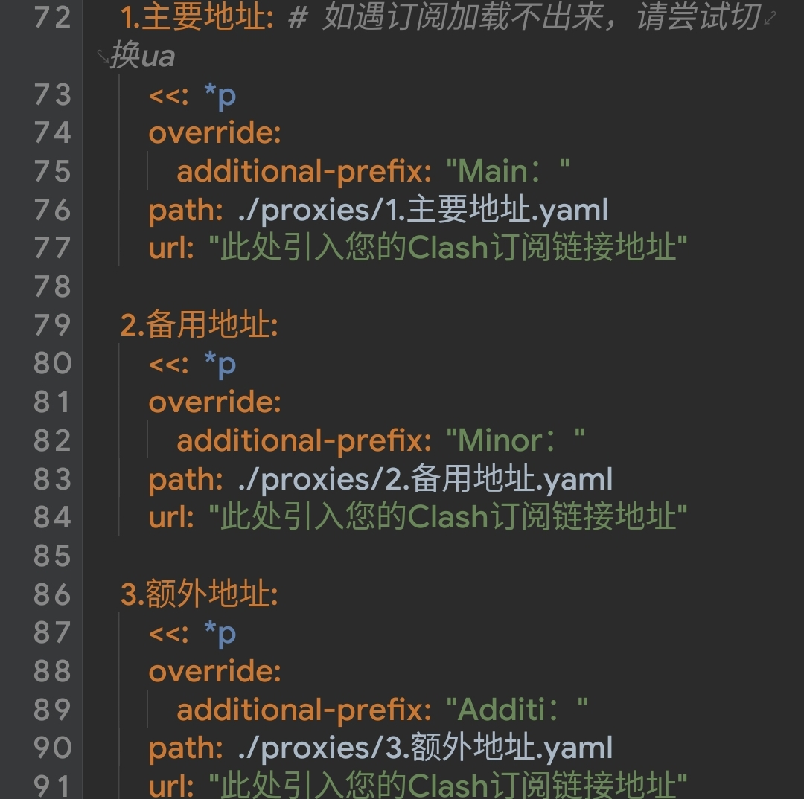
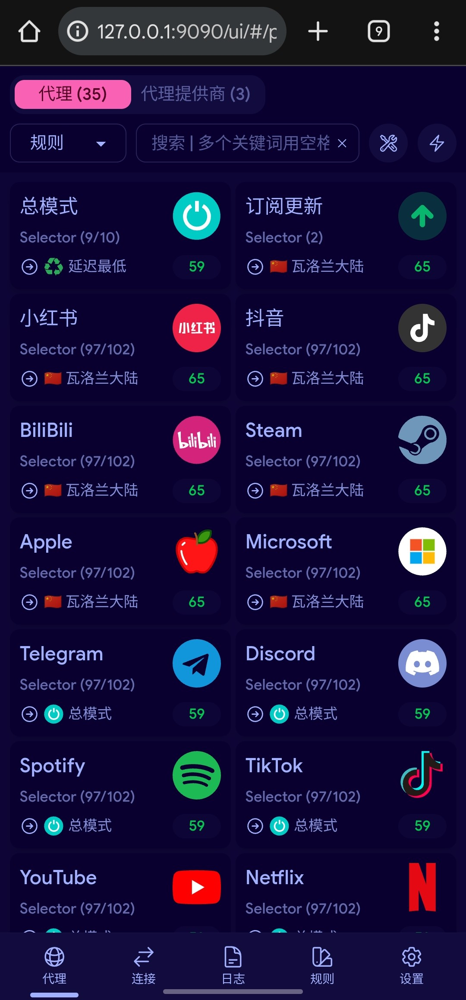

## 免责声明
:::caution
本文内容仅限技术研究学习目的，旨在帮助开发者等深入了解网络代理，流量路由等运作机制。任何不当使用造成的后果均与本文作者无关。严禁用于商业用途。

您必须确保所有操作均遵守您所在国家/地区的法律法规。本文坚决反对并谴责任何使用网络代理技术绕过正当网络管控、访问非法内容或从事任何非法活动的行为。

本文涉及到的操作需要修改Android系统底层，具有潜在风险（如设备变砖，数据丢失，系统不稳定等）。所有操作均基于您自愿选择并自行承担全部风险。本文作者不对任何因遵循本文步骤导致的设备问题或法律纠纷负责。

本文面向具备足够知识背景和风险认知的用户，尝试前请确保您已了解关于root等基本概念。如果您不知道您在做什么，请自觉停止操作。
:::

## INTRO
在开始之前，我们简单对比一下常规代理与`box4magisk`。
::github{repo="CHIZI-0618/box4magisk"}

### CLASH FOR ANDROID

以最常见的`Clash for Android`为例，他通常通过调用Android系统提供的`VPN Service API`工作。

当您在CFA（Clash For Android）中启动代理时，应用会向系统申请创建一个虚拟VPN接口，此时会要求用户授权。随后Android会将设备上几乎所有应用程序的流量都重定向到此接口。

CFA本质上其实是个壳，用于更方便与用户交互，本质其实是Clash核心在处理流量。

Clash内核会根据您配置的规则来检查所有经过的流量，根据规则匹配结果，决定该流量走向。

### BOX4MAGISK

`box4magisk`借助magisk/kernelSU/APatch将clash部署在`data/adb/`，使其深度集成在Android系统的网络栈，实现了更高权限的流量接管。

由于他不依赖`VPN Service API`，因此完全不占用VPN槽位，通过透明代理，使其能绕过大多数检测。

## PRINCIPLE
### TRANSPARENT PROXY
`Transparent Proxy`，也就是透明代理。简单来讲，就是让应用程序无法检测其存在，让应用认为他在直接连接互联网。其劫持实现主要如下

### TUN
`TUN`设备是软件实现的虚拟网络设备。他不像`eth0`或`wlan0`那样是真实的硬件。他就像一个虚拟的网线接口，一端插在系统的`网络栈`，一端插在Clash核心。

其工作原理主要为：

系统根据`iptables`规则，把所有需要被代理的网络流量发送到`TUN`设备。Clash内核则从另一端读取这些原始数据包进行处理，随后经过`TUN`回到系统内核，并出口到目的地。

**TUN设备在网络层工作，处理`IP数据包`使其能够接管所有基于IP的流量。**

### TUN2SOCKS
众所周知，Clash一般监听在SOCKS5/HTTP端口，守听的是预期符合代理协议的数据。但TUN里给出的数据则是原始网络数据包，压根不是一回事。

而`TUN2SOCKS`作为其中的桥梁，达到了翻译的效果。他负责读取TUN来的原始数据包，以客户端身份将其打包为标准的SOCKS5协议格式，并将其发送给Clash内核，这样Clash就可以正常处理这些流量了。

- 对于Clash来说，它只是为叫做`tun2socks`的本地客户的提供代理服务，并不知道其接管的流量来自系统全局。
- 对于应用程序来说，它以为自己是直接连接到互联网，并不知道自己的流量被TUN劫持并转译。

### IPTABLES
系统流量默认可不会自己跑进TUN，在Box4magisk中，使用到了`iptables`让流量走向TUN。

我们先来了解下`iptables`，这是Linux系统内置的数据包过滤和操作工具，不过在这里，他的核心作用不是防火墙，而是对流量进行路由。

Box4magisk在启动时，会添加一系列规则达到`REDIRECT`或`TProxy`到TUN设备的目的。

### 接下来我们会举一个例子，来更好理解他们协同工作时的流量走向

1. app试图连接`blog.chongxi.us:443`
2. `iptables`立即截获此TCP请求，根据规则，将流量引至TUN设备
3. TUN会将流量引至`tun0`
4. `tun2socks`会从`tun0`中读取到这个原始TCP请求，并将其打包为`SOCKS5`协议的`CONNET blog.chongxo.us 443`发给localhost的Clash端口。
5. Clash接收到该请求后，根据代理规则进行出口。

从远程服务器返回的数据则会以以上方式反向走一遍。

## PREREQUISITES
- 一台已获取 Root 权限的 Android 设备
- 获取Magisk模块文件

这里我们使用`Surfing`作为演示，这是fork自`box4magisk`的项目，有集成式一体服务、即刷即用的特色。

您也可以选择原始的`box4magisk`进行配置，后续Chongxi会考虑写关于这个的blog。

::github{repo="GitMetaio/Surfing"}

## LET'S GO
- 在Magisk安装Surfing，此时您无重启设备的必要。
- `/data/adb/box_bll/clash/config.yaml`中，您可以添加您的`远程代理配置URL`。

您也可以根据里面的注释自行修改配置，修改后重启您的设备。
- 打开您的浏览器，输入`http://127.0.0.1:9090/ui/#/`即可打开WebUI控制台，在这里您可以详细设置您的Surfing。

- 关于启停 关闭Magisk模块后即可停止。

Surfing的部署到此完毕。

## CONCLUSION
至此，我们通过 Box4Magisk 模块，我们超越了普通应用的限制，将 Clash 深植于系统底层，实现了真正全局、无感的网络代理。

同时，我们也深入理解了其背后的工作原理，让「魔法」变成了可控的「技术」。

这里是Chongxi，期待与您的下一次见面

_Thanks For Watching._